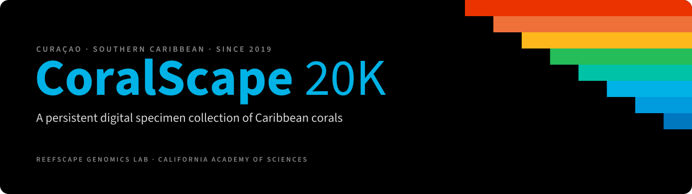
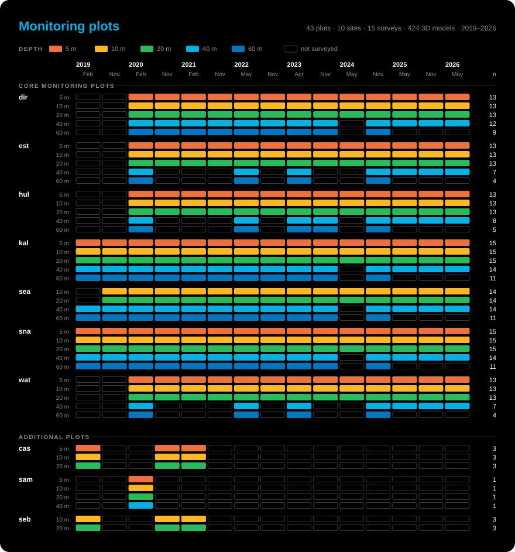
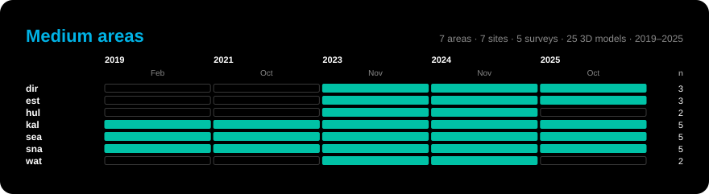

<p align="center">
  
</p>

<p align="center">
  <b>Following the same ~20,000 corals through time in Curaçao, Southern Caribbean.</b><br>
  goals: · resurveys every six months · a genome for every colony · shallow to mesophotic
</p>

<p align="center">
  <a href="#about">About</a> ·
  <a href="#the-collection-at-a-glance">The collection</a> ·
  <a href="#partners-and-funding">Partners and funding</a> ·
  <a href="#citation">Citation</a>
</p>

<table align="center">
  <tr>
    <td align="center"><h3>19,511</h3>tracked corals</td>
    <td align="center"><h3>34</h3>monitoring plots</td>
    <td align="center"><h3>15</h3>survey timepoints</td>
    <td align="center"><h3>449</h3>reef-wide models</td>
    <td align="center"><h3>>5,000</h3>genomes sequenced</td>
  </tr>
</table>

<p align="center"><sub>Figures as of Jan 2026.</sub></p>

## About

**CoralScape 20K** aims to establish a *persistent digital specimen collection*. Across 
34 permament plots along the leeward coast of Curaçao, we have annotated nearly 20,000
individual coral colonies that we track through 6-monthly surveys. Each colony at each 
timepoint is captured as a 3D reconstruction, and minimally-invasive tissue samples are 
gradually collected to be able to characterize genome <-> phenotype <-> environment.

The surveys so far span **three bleaching events and a major disease outbreak**. Linking each colony's response to its genetic makeup shows how genetic variation in natural populations could help corals adapt to changing conditions, and how conservation and restoration can make use of it.

## The collection at a glance

| Feature | Details |
|---|---|
| **Location** | Leeward coast of Curaçao, Southern Caribbean |
| **Survey interval** | Every six months, since 2019/2020 |
| **Disturbances captured** | Three bleaching events, one major disease outbreak |
| **3D data** | Plot-scale photogrammetric reconstructions for every timepoint |
| **3D models** | 449 in total: 424 from monitoring plots (405 core, 19 additional) and 25 from medium areas |
| **Medium areas** | 7 larger areas, one per core site, with 25 3D models since 2019 |
| **Genomic data** | Combination of reduced representation and whole-genome sequencing |

### Survey coverage

Each row is a plot or area; each column is a survey. Filled cells mark when it was surveyed.

<p align="center">
  
</p>

<p align="center">
  
</p>

<sub>Data: [`survey_overview_primary.csv`](data/survey_overview_primary.csv) · [`survey_overview_additional.csv`](data/survey_overview_additional.csv) · [`medium_overview.csv`](data/medium_overview.csv). Figures generated by [`scripts/plot_survey_overview.py`](scripts/plot_survey_overview.py).</sub>

<!-- Map: once site coordinates are released, add a static map image here (assets/img/map.png). -->

<!-- Gallery: add field images here, e.g.
<p align="center">
  
  
</p>
-->


## Partners and funding

CoralScape 20K is an initiative of the [Reefscape Genomics Lab](https://www.reefscapegenomics.com) at the California Academy of Sciences and was designed with the CARMABI Foundation in Curaçao.

This work would not be possible without the support of Mark Vermeij, Rene van der Zande, Michelle Achlatis, Roderick Schmitz, Emma Alves, and Javier Diaz. We also thank Bernardo van Hoof and Goby Divers Curaçao, the team at Substation Curaçao, and Uniek Curaçao for allowing us access to Boka Hulu.

This project has been supported through the “Hope for Reefs” initiative at the California Academy of Sciences, the National Science Foundation (NSF), and Inkfish LLC.

## Citation

If you want to refer to this project, please cite the archived release you used. GitHub's **"Cite this repository"** button (in the sidebar) gives the citation in APA and BibTeX formats.

```bibtex
@misc{coralscape20k,
  author = {Reefscape Genomics Lab},
  title  = {CoralScape 20K: a persistent digital specimen collection of Caribbean corals},
  year   = {2026},
  url    = {https://github.com/reefscapegenomics/coralscape20k},
  note   = {DOI forthcoming}
}
```

<p align="center"><sub>Reefscape Genomics Lab · California Academy of Sciences</sub></p>
